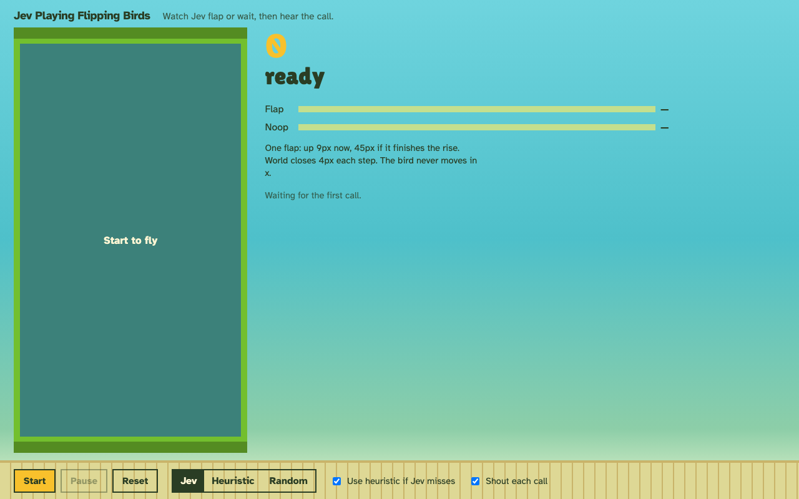
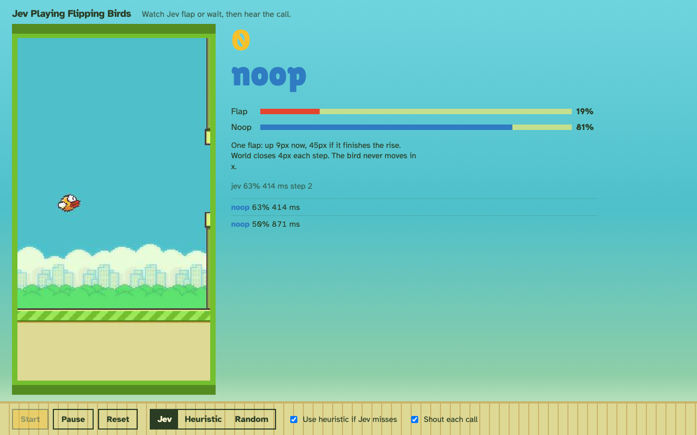
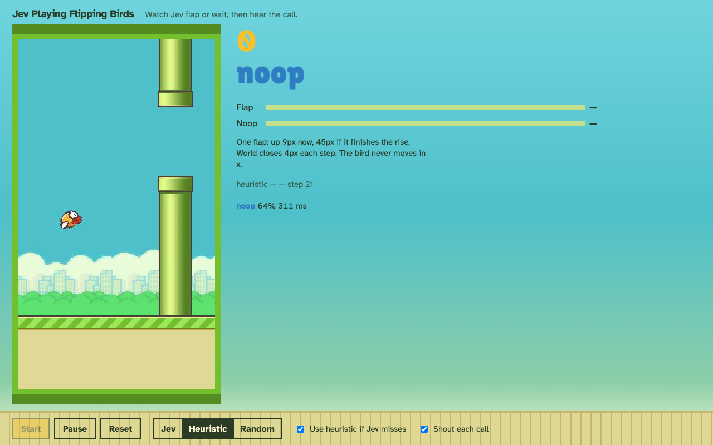
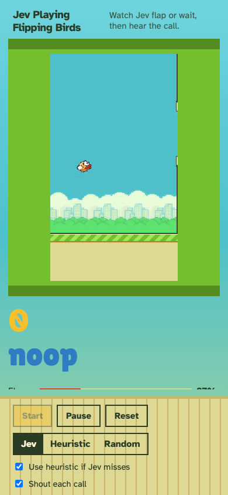

# Jev Playing Flipping Birds

Local demo: TypeSafe Jev plays Flappy Bird through `flappy-bird-gymnasium`. A browser page streams the live game. Jev sees named numeric state only, never screenshots.


<table>
  <tr>
    <td></td>
    <td></td>
  </tr>
  <tr>
    <td></td>
    <td></td>
  </tr>
</table>

## Setup

```bash
uv sync
cp .env.example .env
```

Put your TypeSafe key in `.env` as `TYPESAFE_API_KEY` so Jev can play. Add `OPENAI_API_KEY` to shout each call. Without the TypeSafe key, Jev falls back to the heuristic. Without the OpenAI key, the game stays silent.

## Run

Headless:

```bash
uv run python -m backend.smoke            # env + state + ws checks in one run
uv run python -m backend.smoke.env        # just the env/render check
uv run python -m backend.smoke.state      # just the state-mapping check
uv run python -m backend.play --agent random
uv run python -m backend.play --agent heuristic
uv run python -m backend.play --agent jev
```

Spectator UI:

```bash
uv run uvicorn backend.server.app:app --reload --host 127.0.0.1 --port 8000
```

Then open `http://127.0.0.1:8000`. Start / Pause / Reset, pick Random, Heuristic, or Jev.

## Layout

- `backend/engine/` — env, rendering/encoding, named state mapping, flap physics
- `backend/agent/` — decision policies (random/heuristic/Jev) and `voice.shout`
- `backend/server/` — the minimal spectator app: FastAPI (`app.py`) and the WebSocket game session (`session.py`)
- `backend/smoke/` — headless smoke checks for the engine, state mapping, and web app in one place
- `backend/play.py` — CLI to play one headless episode with a chosen agent
- `frontend/` — live canvas, shouted call, telemetry
- `docs/screenshots/` — README screenshots and gameplay gif
- `.env.example` — `TYPESAFE_API_KEY` and `OPENAI_API_KEY`
- `pyproject.toml` / `uv.lock` — dependencies and locked versions
